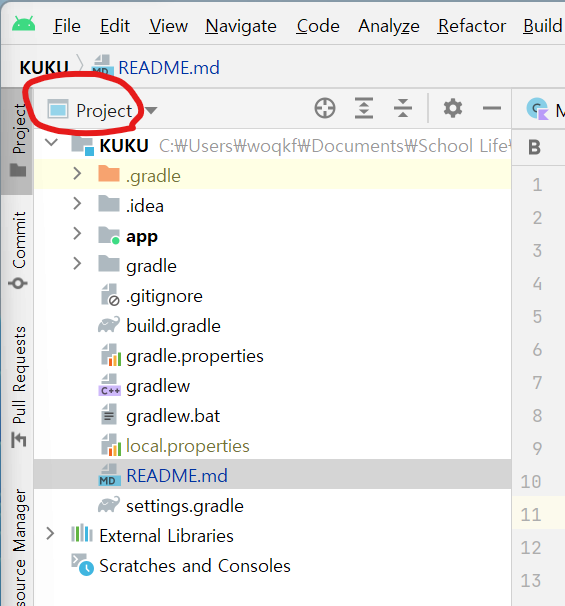

# KUKU
[프로젝트 회의록](https://www.notion.so/invite/d4fb9d42b416d97ff30fc4c683e4377732cb6ef4)
## To Do List

- [x] 깃허브 사용법 익히기
- [ ] 각자 공부해오기
- [ ] 각자 기여하고 싶은 부분 정하기
- [x] 회의록 작성 양식 정하기
- [ ] 전반적인 앱 아키텍처 디자인(클래스 설계)
- [ ] UI 디자인 구성(청사진은 카카오 오븐 활용)
- [ ] 웹 크롤링
- [ ] DB 모델 설계 및 연동

## 코틀린 코딩 표준

* https://developer.android.com/kotlin/style-guide

## 마크다운 작성하기

### 프로젝트 내에서 보는 법
IDE 우측 상단에서 *Project* 뷰로 설정해야 README.md 파일을 찾을 수 있음

### 기본 문법
* [마크다운 가이드](https://docs.github.com/en/get-started/writing-on-github/getting-started-with-writing-and-formatting-on-github/basic-writing-and-formatting-syntax)
* [백준](https://www.acmicpc.net/blog/view/1)
* [해시 코드](https://hashcode.co.kr/questions/1772/%EB%A7%88%ED%81%AC%EB%8B%A4%EC%9A%B4-%EB%AC%B8%EB%B2%95-%EC%9E%91%EC%84%B1-%ED%8C%81)

### 안드로이드 스튜디오에서 프리뷰 기능

> Android Studio -> Help -> Find Action ->
*"Choose Boot Java Runtime for the IDE"* 검색 -> 최신버전 선택 및 다운로드 -> 재시작